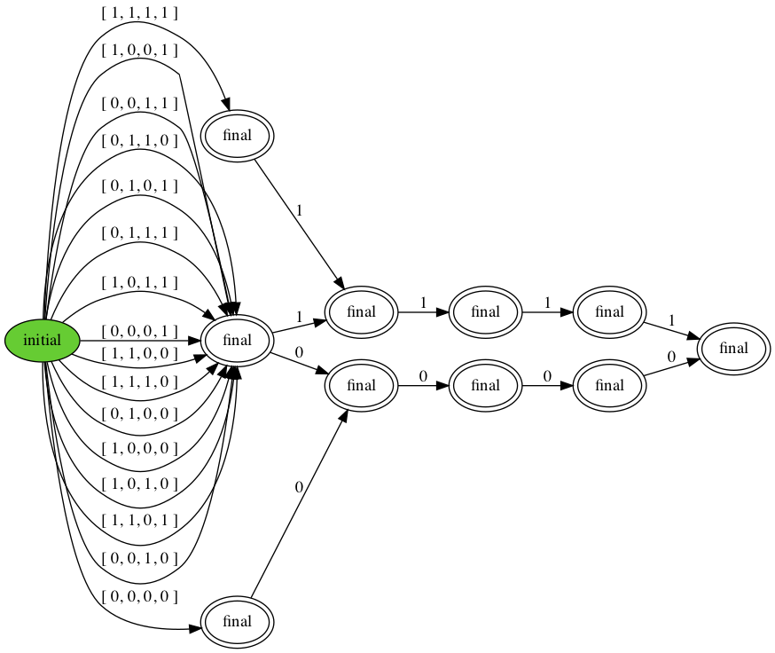
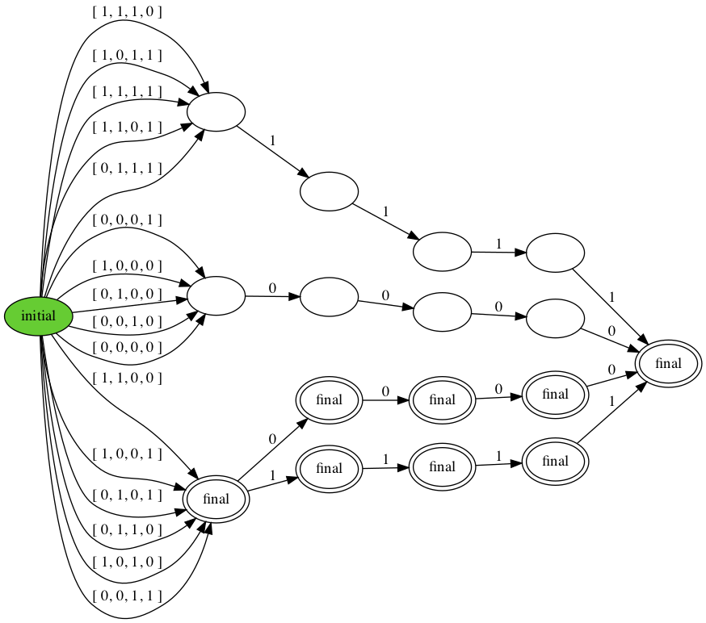

# Distributed Consensus 




```python
const N = 4
proposals = [ choose({0, 1}) for i in {0..N–1} ]
decision = choose { x for x in proposals }

def processor(proposal):
    if choose { False, True }:
        print decision
print proposals
for i in {0..N–1}:
    spawn processor(proposals[i])
```

<figcaption>Figure 31.1 (
<a href=https://harmony.cs.cornell.edu/code/consensus.hny>code/consensus.hny</a>): 
Distributed consensus code and DFA </figcaption>

Distributed consensus is the problem of having a collection of
processors agree on a single value over a network. For example, in state
machine replication, the state machines have to agree on which operation
to apply next. Without failures, this can be solved using leader
election: first elect a leader, then have that leader decide a value.
But consensus often has to be done in adverse circumstances, for example
in the face of processor failures.

Each processor *proposes* a value, which we assume here to be from the
set { 0, 1 }. By the usual definition of consensus, we want the
following three properties:

1.  *Validity*: a processor can only decide a value that has been
    proposed;

2.  *Agreement*: if two processors decide, then they decide the same
    value.

3.  *Termination*: each processor eventually decides.

The consensus problem is impossible to solve in the face of processor
failures and without making assumptions about how long it takes to send
and receive a message. Here we will not worry about
*Termination*.

Figure 31.1 presents a specification for binary consensus---the
proposals are from the set {0, 2} In this case there are four
processors. The proposal of processor *i* is in *proposals*\[*i*\]. The
*decision* is chosen from the set of proposals. Each processor may or
may not print the decision---capturing the absence of the *Termination*
property. It may be that no decisions are made, but that does not
violate either Validity or Agreement. Thus the behavior of the program
is to first print the array of proposals, followed by some subset of
processors printing their decision. Notice the following properties:

-   there are $16 = 2^4$ possible proposal configurations;

-   all processors that decide decide the same value;

-   if all processors propose 0, then all processors that decide decide
    0;

-   if all processors propose 1, then all processors that decide decide
    1.

This is just the specification---in practice we do not have a shared
variable in which we can store the decision a priori. We will present a
simple consensus algorithm that can tolerate fewer than $1/3^{rd}$ of
processors failing by crashing. More precisely, constant `F` contains
the maximum number of failures, and we will assume there are `N` =
3`F` + 1 processors.


```python
import bag
const F = 1
const N = (3 * F) + 1
const NROUNDS = 3
proposals = [ choose({0, 1}) for i in {0..N–1} ]
network = bag.empty()

def broadcast(msg):
    atomically network = bag.add(network, msg)

def receive(round, k):
    let msgs = { e:c for (r,e):c in network where r == round }:
        result = bag.combinations(msgs, k)

def processor(proposal):
    var estimate, decided = proposal, False
    broadcast(0, estimate)
    for round in {0..NROUNDS–1}:
        atomically when exists quorum in receive(round, N – F):
            let count = [ bag.multiplicity(quorum, i) for i in { 0..1 }
]:
                assert count[0] != count[1]
                estimate = 0 if count[0] > count[1] else 1
                if count[estimate] == (N – F):
                    if not decided:
                        print estimate
                        decided = True
                    assert estimate in proposals # check validity
                broadcast(round + 1, estimate)
print proposals
for i in {0..N–1}:
    spawn processor(proposals[i])
```

<figcaption>Figure 31.2 (
<a href=https://harmony.cs.cornell.edu/code/bosco.hny>code/bosco.hny</a>): 
A crash-tolerant consensus protocol </figcaption>

 <figcaption>Figure 31.3 ( The DFA for Figure 31.2
</figcaption>

Figure 31.2 presents our algorithm. Besides the *network* variable, it
uses a shared list of proposals and a shared set of decisions. In this
particular algorithm, all messages are broadcast to all processors, so
they do not require a destination address. The `N` processors go through
a sequence of *rounds* in which they wait for `N` -- `F` messages,
update their state based on the messages, and broadcast messages
containing their new state. The reason that a processor waits for `N` --
`F` rather than `N` messages is because of failures: up to `F`
processors may never send a message and so it would be unwise to wait
for all `N`. You might be tempted to use a timer and time out on waiting
for a particular processor. But how would you initialize that timer?
While we will assume that the network is reliable, there is no guarantee
that messages arrive within a particular time. We call a set of `N` --
`F` processors a *quorum*. A quorum must suffice for the algorithm to
make progress.

The state of a processor consists of its current round number (initially
0) and an estimate (initially the proposal). Therefore, messages contain
a round number and an estimate. To start things, each processor first
broadcasts its initial round number and initial estimate. The number of
rounds that are necessary to achieve consensus is not bounded. But
Harmony can only check finite models, so there is a constant `NROUNDS`
that limits the number of rounds.

In Line 21, a processor waits for `N` -- `F` messages using the Harmony
**atomically** **when** **exists** statement. Since Harmony has to check
all possible executions of the protocol, the `receive`(*round*, *k*)
method returns all *subbags* of messages for the given round that have
size *k* = `N` -- `F`. The method uses a dictionary comprehension to
filter out all messages for the given *round* and then uses the
`bag`.`combinations` method to find all combinations of size *k*. The
**atomically** **when** **exists** statement waits until there is at
least one such combination and then chooses an element, which is bound
to the *quorum* variable. The body of the statement is then executed
atomically. This is usually how distributed algorithms are modeled,
because they can only interact through the network. There is no need to
interleave the different processes other than when messages are
delivered. By executing the body atomically, a lot of unnecessary
interleavings are avoided and this reduces the state space that must be
explored by the model checker significantly.

The body of the **atomically** **when** **exists** statement contains
the core of the algorithm. Note that `N` -- `F` = 2`F` + 1, so that the
number of messages is guaranteed to be odd. Also, because there are only
0 and 1 values, there must exist a majority of zeroes or ones. Variable
*count*\[0\] stores the number of zeroes and *count*\[1\] stores the
number of ones received in the round. The rules of the algorithm are
simple:

-   update *estimate* to be the majority value;

-   if the quorum is unanimous, decide the value.

After that, proceed with the next round.

To check for correct behavior, run the following two commands:

    $ harmony -o consensus.hfa code/consensus.hny
    $ harmony -B consensus.hfa code/bosco.hny

Note that the second command prints a warning:
"`behavior warning: strict subset of specified behavior`." Thus, the set
of behaviors that our algorithm generates is a subset of the behavior
that the specification allows. Figure 31.3 shows the behavior, and
indeed it is not the same as the behavior of Figure 31.1. This is
because in our algorithm the outcome is decided a priori if more than
twothirds of the processors have the same proposal, whereas in the
consensus specification the outcome is only decided a priori if the
processors are initially unanimous. Another difference is that if the
outcome is decided a priori, all processors are guaranteed to decide.


```python
import bag
const F = 1
const N = (3 * F) + 1
const NROUNDS = 3
let n_zeroes = choose { 0 .. N / 2 }:
    proposals = ([0,] * n_zeroes) + ([1,] * (N – n_zeroes))
network = bag.empty()

def broadcast(msg):
    atomically network = bag.add(network, msg)

def receive(round):
    let msgs = { e:c for (r,e):c in network where r == round }:
        result = {} if bag.size(msgs) < N else { msgs }

def processor(proposal):
    var estimate, decided = proposal, False
    broadcast(0, estimate)
    for round in {0..NROUNDS–1}:
        atomically when exists msgs in receive(round):
            let choices = bag.combinations(msgs, N – F)
            let quorum = choose(choices)
            let count = [ bag.multiplicity(quorum, i) for i in { 0..1 }
]:
                assert count[0] != count[1]
                estimate = 0 if count[0] > count[1] else 1
                if count[estimate] == (N – F):
                    if not decided:
                        print estimate
                        decided = True
                    assert estimate in proposals # validity
                broadcast(round + 1, estimate)
print proposals
for i in {0..N–1}:
    spawn processor(proposals[i])
```

<figcaption>Figure 31.4 (
<a href=https://harmony.cs.cornell.edu/code/bosco2.hny>code/bosco2.hny</a>): 
Reducing the state space </figcaption>

While one can run this code within little time for `F` = 1, for `F` = 2
the state space to explore is already quite large. One way to reduce the
state space to explore is the following realization: each processor only
considers messages for the round that it is in. If a message is for an
old round, the processor will ignore it; if a message is for a future
round, the processor will buffer it. So, one can simplify the model and
have each processor wait for *all* `N` messages in a round instead of
`N` -- `F`. It would still have to choose to consider just `N` -- `F`
out of those `N` messages, but executions in which some processors are
left behind in all rounds are no longer considered. It still includes
executions where some subset of `N` -- `F` processors only choose each
other messages and essentially ignore the messages of the remaining `F`
processors, so the resulting model is just as good.

Another way to reduce the state space to explore is to leverage
symmetry. First of all, it does not matter who proposes a particular
value. Also, the values 0 and 1 are not important to how the protocol
operates. So, with 5 processors (`F` = 2), say, we only need to explore
the cases where no processors propose 1, where exactly one processors
proposes 1, and where 2 processors proposes 1.

Figure 31.4 shows the code for this optimized model. Running this
with `F` = 2 does not take very long and this approach is a good
blueprint for testing other round-based protocols (of which there are
many).

## Exercises 


The algorithm as given works in the face of crash failures. A more
challenging class to tolerate are *arbitrary failures* in which up to
`F` processors may send arbitrary messages, including conflicting
messages to different peers (equivocation). The algorithm can tolerate
those failures if you use $\texttt{N} = 5\texttt{F} - 1$ processors
instead of $\texttt{N} = 3\texttt{F} - 1$. Check that.

In 1983, Michael Ben-Or presented a randomized algorithm that can
tolerate crash failures with just $\texttt{N} = 2\texttt{F} - 1$
processors. Implement this algorithm.

