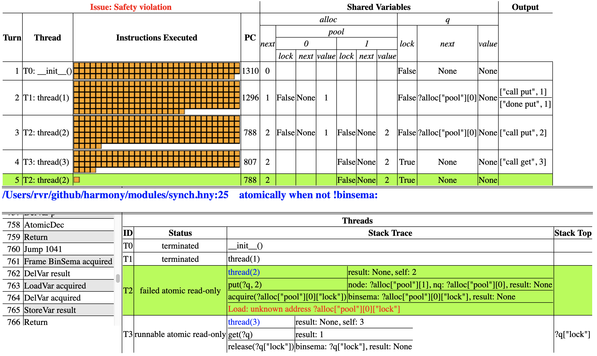

# Debugging 


```python
from synch import Lock, acquire, release
from alloc import malloc, free

def Queue():
    result = { .next: None, .value: None, .lock: Lock() }

def put(q, v):
    let node = malloc({ .next: None, .value: v, .lock: Lock() }):
        var nq = q
        while nq != None:
            acquire(?nq->lock)
            let n = nq->next:
                if n == None:
                    nq->next = node
                release(?nq->lock)
                nq = n

def get(q):
    acquire(?q->lock)
    if q->next == None:
        result = None
    else:
        let node = q->next:
            q->next = node->next
            result = node->value
            free(node)
    release(?q->lock)
```

<figcaption>Figure 14.1 (
<a href=https://harmony.cs.cornell.edu/code/queuebroken.hny>code/queuebroken.hny</a>): 
Another buggy queue implementation </figcaption>




So, you wrote a Harmony program and Harmony reports a problem. Often you
may just be able to figure it out by staring at the code and going
through some easy scenarios, but what if you don't? The output of
Harmony can be helpful in that case.

Figure 14.1 contains an attempt at a queue implementation where
the queue is implemented by a linked list, with the first node being a
`dummy` node to prevent data races. Each node in the list contains a
lock. The `put`() method walks the list until it gets to the last node,
each time acquiring the lock to access the node's fields. When `put`()
gets to the last node in the list, it appends a new one. The `get`()
method locks the first (dummy) node, removes the second from the list
and frees it. The method returns the value from the removed node.

Let us run the code through the test programs in the last chapter.
Harmony does not detect any issues with the sequential test in
Figure 13.2. (Run this using the `-m` flag like this:
`harmony -m queue=queuebroken code/qtestseq.hny`) However, when we run
the new queue code through the test in Figure 13.3, Harmony reports
a safety violation (even without specifying a behavior). The command
line to reproduce this is:

    harmony -m queue=queuebroken code/qtestpar.hny

Before we go look at the details of what went wrong, we want to make
sure that we generate the simplest scenario. So, first we want to
explore what the smallest `NOPS` (number of operations or number of
threads) that causes the bug to occur. With some experimentation, we
find that `NOPS` = 2 does not find a problem, but `NOPS` = 3 does
(`harmony -m queue=queuebroken -c NOPS=3 code/qtestpar.hny`)).
Figure 14.2 shows the Harmony output.

There is quite a bit of information in the Harmony output, and while it
may seem intimidating, we have to learn to navigate through it
step-by-step. Let's start with looking at the red text. Harmony found a
safety violation (something bad happened during one of the possible
executions), and in particular `thread`(2) (thread T2) was trying to
dereference the address ?`alloc`\[`"`pool`"`\]\[0\]\[`"`lock`"`\] (aka
?`alloc`.*pool*\[0\].*lock*).

The `alloc` module maintains a shared array *pool* that it uses for
dynamic allocation. Apparently T2 tried to access *pool*\[0\], but it
does not exist, meaning that either it was not yet allocated, or it had
been freed since it was allocated. When we look at the top half of the
figure, we see that in fact thread T1 allocated *pool*\[0\] in turn 2,
but T3 freed it in turn 4. Looking back down, we see that T1 executed
`thread`(1) and has since terminated, while T3 is executing `thread`(3).

Looking further at the stack traces, we can see that T3 was in the
process of executing `release`(?*q*.*lock*) within `get`(?*q*). T1 is
currently executing `acquire`(?`alloc`.*pool*\[0\].*lock*) within
`put`(?*q*, 2), but `alloc`.*pool*\[0\] does not exist. The
corresponding line of Harmony code is **atomically** **when** **not**
!*binsema* in line 25 of the `sync` module.

So, how did we get there? In the top we can see that the order of events
was the following:

1.  initialization completed, with *q* being { .*lock*: `False`,
    .*next*: `None`, .*value*: `None` };

2.  thread T1 (`thread`(1)) ran and finished executing `put`(1) (see the
    output column for that clue: the thread printed that). We can see
    that *q*.*next* now points to `alloc`.*pool*\[0\], which the thread
    must have allocated. The contents is { .*lock*: `False`, .*next*:
    `None`, .*value*: 1 }, as expected;

3.  thread T2 (`thread`(1)) started running, calling `put`(?*q*, 2). We
    can see it got as far as putting 2 on the queue, but it is not yet
    done. It is currently trying to acquire `alloc`.*pool*\[0\].*lock*;

4.  thread T3 (`thread`(1)) started running, calling `get`(?*q*). We can
    also see that it freed *pool*\[0\], and is now releasing *q*.*lock*;

5.  thread T2 resumes and tries to access *pool*\[0\], which no longer
    exists (because T3 just freed it).

Clearly there was a race in which T2 was trying to lock
*pool*\[0\].*lock* (which contained the node with the value 1) while T3
was freeing that very same node, and T2 lost the race. More precisely,
T2 was executing `put`(?*q*, 2), when T3 preempted it with `get`(?*q*)
and removed the node that T2 was trying to access. But why did the locks
not prevent this?

It is time to start stepping through the code that has been executed
before this happened. This is sometimes known as *reverse debugging*. In
fact, Harmony allows you to step through an execution forwards and
backwards. In this case, we first want to see what T2 is doing. You can
click on its first (top-left) orange box to time-travel to that part in
the execution. Now by hitting $\langle\mathtt{return}\rangle$
repeatedly, we can quickly skip through the code. T2 first calls
`put`(?*q*, 1) and then allocates a new node initialized with a lock.
Keep stepping until it executes *nq* = *q*. Hit
$\langle\mathtt{return}\rangle$ once more and inspect the state of T2 in
the lower-right corner. You can see that variable *nq* is initialized
to ?*q*. T2 then enters into the **while** loop and tries to acquire
*nq*->*lock*. This succeeds, and next T2 executes **let** *n*
= *nq*->*next*. Now *n* = ?`alloc`.*pool*\[0\], which is not
`None`. It then releases *nq*->*lock* (*nq* points to *q*).
It then sets *nq* to $n$, which is still `alloc`.*pool*\[0\]. Finally,
it calls `acquire`(?*nq*->*lock*). But before it can complete
that operation, T3 runs next.

T3 chooses `"`get`"` and then goes on to invoke `get`(?*q*). This first
successfully acquires *q*}->*lock*. T3 then finds out that
*q*->*next* points to `alloc`.*pool*\[0\]. T3 sets *node* to
`alloc`.*pool*\[0\] as well and sets *q*->*next* to
*node*->*next*. T3 sets *result* to
*node*->*value* (which is 1) and then frees *node*. This is
where the problem is---T2 is about to acquire the lock in that same
node.

To fix the code without changing the data structure, we can use
hand-over-hand locking ([Chapter 12](finegrained.md)). Figure 14.3 shows an
implementation that uses hand-over-hand locking both for `put`() and for
`get`(). It passes all tests.


```python
from synch import Lock, acquire, release
from alloc import malloc, free

def Queue():
    result = { .next: None, .value: None, .lock: Lock() }

def put(q, v):
    var nq = q
    let node = malloc({ .next: None, .value: v, .lock: Lock() }):
        acquire(?nq->lock)
        var n = nq->next
        while n != None:
            acquire(?n->lock)
            release(?nq->lock)
            nq = n
            n = n->next
        nq->next = node
        release(?nq->lock)

def get(q):
    acquire(?q->lock)
    if q->next == None:
        result = None
    else:
        let node = q->next:
            acquire(?node->lock)
            q->next = node->next
            result = node->value
            release(?node->lock)
            free(node)
    release(?q->lock)
```

<figcaption>Figure 14.3 (
<a href=https://harmony.cs.cornell.edu/code/queuefix.hny>code/queuefix.hny</a>): 
Queue implementation with hand-over-hand locking
</figcaption>
