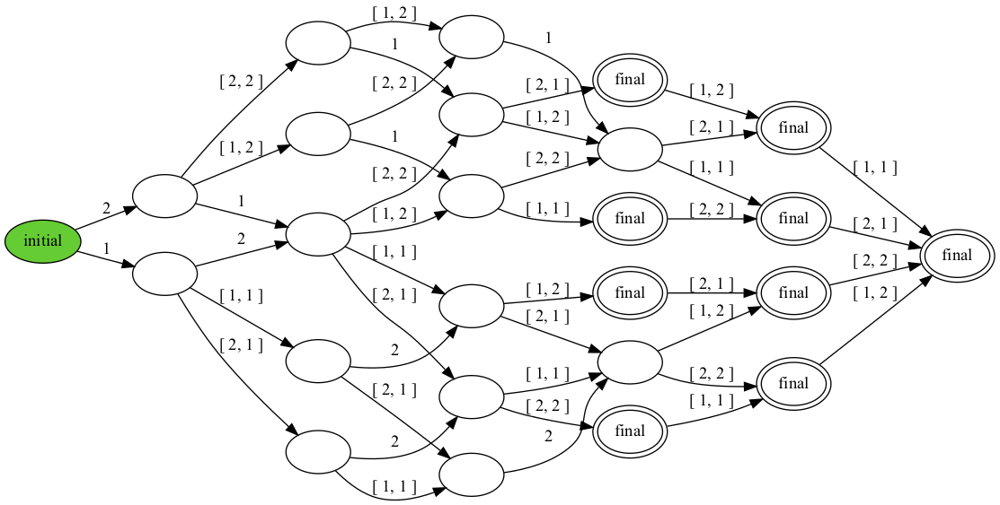

# Chain Replication 

As you have probably experienced, computers can crash. If you are
running a web service, you may not be able to afford a long outage. If
you are running software that flies a plane, then an outage for any
length of time could lead to a disaster. To deal with service outages
caused by computers crashing, you may want to *replicate* the service
onto multiple computers. As long as one of the computers survives, the
service remains available.

Besides availability, it is usually important that the replicated
service acts as if it were a single one. This requires that the replicas
of the service coordinate their actions. The *Replicated State Machine
Approach* is a general approach to do just this. First,
you model your service as a deterministic state machine. The replicas
each run a copy of the state machine, started in the same state. As long
as the replicas handle the same inputs in the same order, determinism
guarantees that they produce the same outputs in the same order.

```python title="rsmspec.hny"
--8<-- "rsmspec.hny"
```

<figcaption>Figure 27.1 (<a href=https://harmony.cs.cornell.edu/code/rsmspec.hny>code/rsmspec.hny</a>): 
Replicated State Machine </figcaption>

Figure 27.1 presents a Harmony specification of state machine
replication. We model the state machine as a *history*: a sequence of
operations. Each replica has a local copy of the history. The network is
modeled as an ordered queue of messages. `NOPS` clients each place an
operation on the network. All but one of the replicas is allowed to
crash. The model chooses one of the replicas that is not allowed to
crash. Of course, a replica does not know whether it is immortal or not
in practice---it should just assume that it is. The immortality of one
of the replicas is only used for modeling the assumptions we make about
the system. A replica loops until either it fails or it has received all
operations. **choose**({ *immortal*, `True` }) can only evaluate to
`False` in case *immortal* = `False`; otherwise it will always evaluate
to `True`. After a replica has received all `NOPS` operations, the
replica finishes and prints its history. All replicas will print the
same history (which should be the same as the network).

But in reality the network is not an ordered queue and better modeled as
a set of messages. The trick now is to ensure that all replicas handle
the same requests in the same order and to do so in a way that continues
to work even if some strict subset of replicas crash. *Chain
Replication* is such a replication protocol. In Chain
Replication, the replicas are organized in a linear chain. Each replica
monitors its direct predecessor in the chain. If a replica has no
predecessors, we call it the *head*. The head may change over time, as a
head may crash and replaced by another, but at any point in time there
is only one head (and only one *tail*, possibly the same replica).

Only the head is allowed to accept new updates from clients. When it
does so, it adds the update to the end of its history and sends the
history to its successor on the chain. When the direct successor
receives such a history, it makes sure that the history is an extension
of its own and, if so, replaces its own history with the one received.
It then sends the history on to its successor, if any.

So, when a replica fails, its successors should find out about it. In
practice, one server can detect the failure of another server by pinging
it. If a server does not receive a response to its ping within some
maximum amount of time, then the server considers its peer crashed. Note
that this, in general, is not a safe thing to do---the network or the
peer may be temporarily slow but the peer is not necessarily crashed
when the timer expires. Nonetheless, we will assume here that failure
detection does not make mistakes and that eventually every failure is
eventually detected. This is called the *Fail-Stop* failure
model, which is distinct from the often more realistic *Crash
Failure* model where processes can crash but accurate detection is not
available. We will consider that more realistic failure model in the
upcoming chapters.

```python title="chain.hny"
--8<-- "chain.hny"
```

<figcaption>Figure 27.2 (<a href=https://harmony.cs.cornell.edu/code/chain.hny>code/chain.hny</a>): 
Chain Replication </figcaption>

Figure 27.2 shows an implemenation of chain replication. Each replica
maintains its history and a set of its predecessors. What it does within
the loop depends on whether it is the head (has no alive predecessors)
or not. Because failure detection is accurate, at most one replica can
think it is the head at any time (and, if so, it is in fact the head).
Moreover, when it has detected all its predecessors having failed,
eventually some replica thinks it is the head.

Messages have the format $(\mathit{source}, \mathit{payload})$, where
*source* is the identifier of the replica that generated the message and
*payload* has information about the state of the replica. The payload
can take one of two forms. The first is .*crash*, indicating that the
source of the message has crashed. The code models a replica crashing by
that replica broadcasting a .*crash* message on the network. The other
form is a history of operations.

If a replica thinks it is the head, it adds an operation to its history.
The head then broadcasts its history, which is intended for its
successor. Because of failures, it may be that at different times a
replica has different successors, hence the broadcast.

Otherwise, the replica does not believe it is the head and awaits a
message from its direct predecessor. If the payload is .*crash*, then
the replica removes this predecessor from its set of predecessors. For
example, if there are initially three replicas numbered 0, 1, and 2, and
replica 1 crashes, then replica 2 removes 1 from its set of
predecessors, making replica 0 its direct (and only) predecessor.
Otherwise, the payload must be a history. The replica only accepts the
history if it is an extension of its own history. When the replica
successfully received all `NOPS` updates without crashing, it prints its
history.

The question is whether Figure 27.2 has the same behavior as the
replicated state machine specification of Figure 27.1. This can be
checked using the following two Harmony commands:

    $ harmony -o rsm.hfa code/rsmspec.hny
    $ harmony -B rsm.hfa code/chain.hny

The first command outputs the behavior DFA of `code/rsmspec.hny` in the
file `rsm.hfa`. The second command checks that the behavior of
`code/chain.hny` satisfies the DFA in `rsm.hfa`. The DFA can also be
visualized using the command `harmony -o rsm.png code/rsmspec.hny`
(Figure 27.3). It shows all permutations of the operations are
possible outputs. Moreover, each is output at least once, and at most
`NREPLICAS` times.



The model has each replica send its entire history each time it extends
its history. This is fine for modeling, but in practice that would not
scale. In practice, a predecessor would set up a TCP connection to its
successor and only send updates to its history along the TCP connection.
Because TCP connections guarantee FIFO order, this would be identical to
the predecessor sending a series of histories, but much more efficient.
