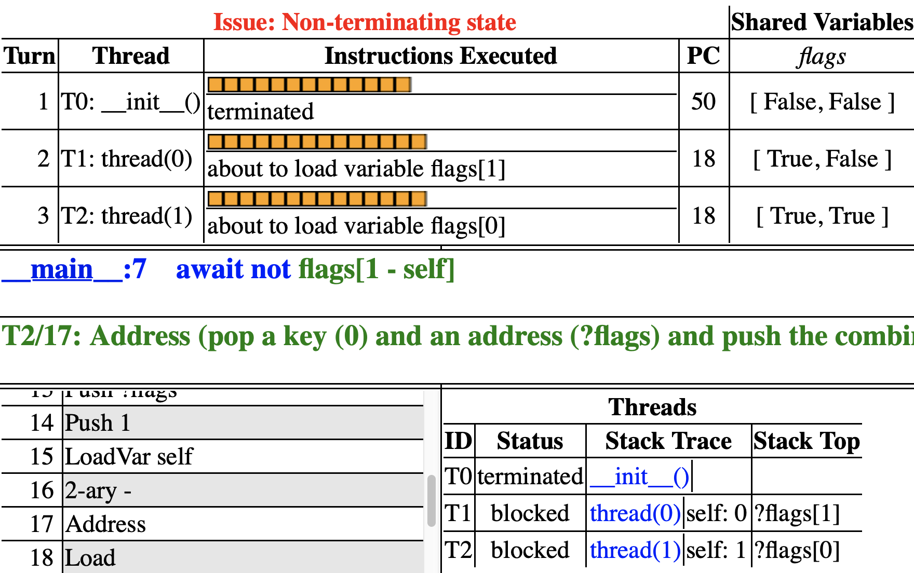

# Critical Sections 


Hopefully you have started thinking of how to solve the concurrency
problem and you may already have prototyped some solutions. In this
chapter, we will go through a few reasonable but broken attempts. At the
heart of the problem is that we would like make sure that, when the
*count* variable is being updated, no other thread is trying to do the
same thing. This is called a *critical section* (aka critical
region): a set of instructions where only one thread is
allowed to execute at a time.

Critical sections are useful when accessing a shared data structure,
particularly when that access requires multiple underlying machine
instructions. A counter is a very simple example of a data structure (it
is an array of bits), but---as we have seen---incrementing it requires
multiple instructions. A more involved one would be accessing a binary
tree. Adding a node to a binary tree, or re-balancing a tree, often
requires multiple operations. Maintaining "consistency" is certainly
much easier if during this time no other thread also tries to access the
binary tree. Typically, you want some invariant property of the data
structure to hold at the beginning and at the end of the critical
section, but in the middle the invariant may be temporarily
broken---this is not a problem as critical sections guarantee that no
other thread will be able to see it. An implementation of a data
structure that can be safely accessed by multiple threads and is free of
race conditions is called *thread-safe*.

```python title="csbarebones.hny"
--8<-- "csbarebones.hny"
```

<figcaption>Figure 5.1 (<a href=https://harmony.cs.cornell.edu/code/csbarebones.hny>code/csbarebones.hny</a>): 
A bare bones critical section with two threads
</figcaption>


```python title="cs.hny"
--8<-- "cs.hny"
```

<figcaption>Figure 5.2 (<a href=https://harmony.cs.cornell.edu/code/cs.hny>code/cs.hny</a>): 
Harmony model of a critical section</figcaption>

A critical section is often modeled as threads in an infinite loop
entering and exiting the critical section. Figure 5.1 shows the
Harmony code. Here `cs` is a *label*, identifying a location in the HVM
bytecode. The first thing we need to ensure is that there can never be
two threads in the critical section. This property is called *mutual
exclusion*. We would like to place an assertion at the `cs` label that
specifies that only one (the current) thread can be there.

Harmony in fact supports this. It has an operator **countLabel** *l*,
where *l* is the name of the label (in this case, `cs`). The operator
returns the number of threads executing at that label. Method
**countLabel** only exists for specification purposes---do not use it in
normal code. If you run the code through Harmony, the assertion should
fail because there is no code yet for safely entering and exiting the
critical section.

However, mutual exclusion by itself is easy to ensure. For example, we
could insert the following code to enter the critical section:
```
await False
```
This code will surely prevent two or more threads from being at label
`cs` at the same time. But it does so by preventing *any* thread from
reaching the critical section. We clearly need another property besides
mutual exclusion.

Mutual exclusion is an example of a *safety property*, a property that
ensures that *nothing bad will happen*, in this case two threads being
in the critical section. What we need now is a *liveness property*: we
want to ensure that *eventually something good will happen*. There are
various possible liveness properties we could use, but here we will
propose the following informally: if (1) there exists a non-empty set
$S$ of threads that are trying to enter the critical section and (2)
threads in the critical section always leave eventually, then eventually
one thread in $S$ will enter the critical section. We call this
*progress*.

In order to detect violations of progress, and other liveness problems
in algorithms in general, Harmony requires that every execution must be
able to reach a state in which all threads have terminated. Clearly,
even if mutual exclusion holds in Figure 5.1, the spawned
threads never terminate. We will instead model threads in critical
sections using the framework in Figure 5.2: a thread can *choose* to
enter a critical section more than once, but it can also choose to
terminate, even without entering the critical section ever. (Recall that
Harmony will try every possible execution, and so it will evaluate both
choices.) As it turns out, there is an advantage to doing it this way:
we can also test if a thread can enter when there is no other thread
trying to enter the critical section. As we will see below, this is not
always obvious.

We will now consider various approaches toward implementing this
specification.


```python title="naiveLock.hny"
--8<-- "naiveLock.hny"
```

 <figcaption>Figure 5.3 (<a href=https://harmony.cs.cornell.edu/code/naiveLock.hny>code/naiveLock.hny</a>): 
Naı̈ve implementation of a shared lock and the [[HTML
output]{.underline}](https://harmony.cs.cornell.edu/output/naiveLock.html) of running Harmony on Figure 5.3 </figcaption>


```python title="naiveFlags.hny"
--8<-- "naiveFlags.hny"
```

 <figcaption>Figure 5.4 (<a href=https://harmony.cs.cornell.edu/code/naiveFlags.hny>code/naiveFlags.hny</a>): 
Naı̈ve use of flags to solve mutual exclusion and the [[HTML
output]{.underline}](https://harmony.cs.cornell.edu/output/naiveFlags.html)
of running Harmony on Figure 5.4 </figcaption>


```python title="naiveTurn.hny"
--8<-- "naiveTurn.hny"
```

<figcaption>Figure 5.5 (
<a href=https://harmony.cs.cornell.edu/code/naiveTurn.hny>code/naiveTurn.hny</a>): 
Naı̈ve use of turn variable to solve mutual exclusion
</figcaption>

You may already have heard of the concept of a *lock* and have realized
that it could be used to implement a critical section. The idea is that
the lock is like a baton that at most one thread can own (or hold) at a
time. A thread that wants to enter the critical section at a time must
obtain the lock first and release it upon exiting the critical section.

Using a lock is a good thought, but how does one implement one?
Figure 5.3 presents an attempt at mutual exclusion based on a
naı̈ve (and, as it turns out, incorrect) implementation of a lock.
Initially the lock is not owned, indicated by *lockTaken* being `False`.
To enter the critical section, a thread waits until *lockTaken* is
`False` and then sets it to `True` to indicate that the lock has been
taken. The thread then executes the critical section. Finally, the
thread releases the lock by setting *lockTaken* back to `False`.

Unfortunately, if we run the program through Harmony, we find that the
assertion fails. Figure 5.3 also shows the Harmony output.
`thread`(1) finds that the lock is available, but just before it stores
`True` in *lockTaken*, `thread`(0) gets to run. (Recall that you can
hover your mouse over a machine instruction in order to see what it
does.) Because *lockTaken* is still `False`, it too believes it can
acquire the lock, and stores `True` in *lockTaken* and moves on to the
critical section. Finally, `thread`(1) moves on, also stores `True` into
*lockTaken* and also moves into the critical section. `thread`(1) is the
one that detects the problem. The *lockTaken* variable suffers from the
same sort of race condition as the *count* variable in Figure 3.2:
testing and setting the lock consists of several instructions. It is
thus possible for both threads to believe the lock is available and to
obtain the lock at the same time.

Preventing multiple threads from updating the same variable,
Figure 5.4 presents a solution based on each thread having a
flag indicating that it is trying to enter the critical section. A
thread can write its own flag and read the flag of its peer. After
setting its flag, the thread waits until the other thread
($1 - \mathit{self}$) is not trying to enter the critical section. If we
run this program, the assertion does not fail. In fact, this solution
does prevent both threads being in the critical section at the same
time.

To see why, first note the following invariant: if thread *i* is in the
critical section, then *flags*\[*i*\] = `True`. Without loss of
generality, suppose that thread 0 sets *flags*\[0\] at time $t_0$.
Thread 0 can only reach the critical section if at some time $t_1$,
$t_1 > t_0$, it finds that *flags*\[1\] = `False`. Because of the
invariant, *flags*\[1\] = `False` implies that thread 1 is not in the
critical section at time $t_1$. Let $t_2$ be the time at which thread 0
sets *flags*\[0\] to `False`. Thread 0 is in the critical section
sometime between $t_1$ and $t_2$. It is easy to see that thread 1 cannot
enter the critical section between $t_1$ and $t_2$, because *flags*\[1\]
= `False` at time $t_1$. To reach the critical section between $t_1$ and
$t_2$, it would first have to set *flags*\[1\] to `True` and then wait
until *flags*\[0\] = `False`. But that does not happen until time $t_2$.

However, if you run the program through Harmony, it turns out the
solution does have a problem: if both try to enter the critical section
at the same time, they may end up waiting for one another indefinitely.
(This is a form of *deadlock*, which will be discussed in
[Chapter 19](deadlock.md).) Thus the solution violates *progress*.

The final naı̈ve solution that we propose is based on a variable called
*turn*. Each thread politely lets the other thread have a turn first.
When *turn* = *i*, thread *i* can enter the critical section, while
thread $1-i$ has to wait. An invariant of this solution is that while
thread *i* is in the critical section, *turn* = *i*. Since *turn* cannot
be 0 and 1 at the same time, mutual exclusion is satisfied. The solution
also has the nice property that the thread that has been waiting the
longest to enter the critical section can go next.

Run the program through Harmony. It turns out that this solution also
violates *progress*, albeit for a different reason: if thread *i*
terminates instead of entering the critical section, thread $1-i$,
politely, ends up waiting indefinitely for its turn. Too bad, because it
would have been a great solution if both threads try to enter the
critical section ad infinitum.

## Exercises 


**5.1** Run Figure 5.2 using Harmony. As there is no protection of the critical
section, mutual exclusion is violated, the assertion should fail, and a
trace should be reported. Now insert
```
await False
```
just before entering the critical section in Figure 5.2 and run Harmony
again. Mutual exclusion is guaranteed but progress is violated. Harmony
should print a trace to a state from which a terminating state cannot be
reached. Describe in English the difference in the failure reports
before and after inserting the code.

**5.2** See if you can come up with some different approaches that satisfy both
mutual exclusion and progress. Try them with Harmony and see if they
work or not. If they don't, try to understand why. If you get *active
busy waiting* or *data race* reports, you probably found a correct
solution; you'll learn later how to suppress those. Do not despair if
you can't figure out how to develop a solution that satisfies both
mutual exclusion and progress---as we will find out, it is possible but
not obvious.

