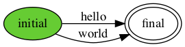
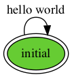

# Hello World! 

The first programming book that I read cover to cover was *The C
Programming Language* (first edition) by Brian W. Kernighan and Dennis
M. Ritchie, which was around 1980. I did not know at the time that 10
years later Dennis, the designer of the C programming language, would be
my boss at AT&T Bell Labs in Murray Hill, NJ, while Brian would be my
colleague in the same lab. The first C program in the book printed the
string "hello, world". Since then, most programming tutorials for pretty
much any programming language start with that example.

Harmony, too, has a Hello World program. Figure 2.1 shows the
program and the corresponding output. After installation 
(see https://harmony.cs.cornell.edu), you can run it as 
follows from the command line:

    $ harmony -o hello1.png code/hello1.hny

For this to work, make sure `harmony` is in your command shell's search
path. The code for examples in this book can be found in the `code`
folder under the name listed in the caption of the example.
If you need to, you can download the sources separately from
https://harmony.cs.cornell.edu/sources.zip. In this
case, the file `code/hello1.hny` contains the code in
Figure 2.1. The `-o hello1.png` arguments tell harmony to write
the output in the file `hello1.png`. The output is a *Deterministic
State Machine* (DFA). The green circle represents the initial state and
the double circle represents the final state. There is one *transition*,
labeled with the string "hello world". The DFA describes (or
*recognizes*) all possible outputs that the program can generate. In
this case, there is only one.


```python title="hello1.hny"
--8<-- "hello1.hny"
```

<figcaption>Figure 2.1 (
<a href=https://harmony.cs.cornell.edu/code/hello1.hny>code/hello1.hny</a>): 
Hello World! </figcaption>




```python title="hello3.hny"
--8<-- "hello3.hny"
```

<figcaption>Figure 2.2 (
<a href=https://harmony.cs.cornell.edu/code/hello3.hny>code/hello3.hny</a>): 
Harmony program with two possible outputs</figcaption>




```python title="hello4.hny"
--8<-- "hello4.hny"
```

<figcaption>Figure 2.3 (
<a href=https://harmony.cs.cornell.edu/code/hello4.hny>code/hello4.hny</a>): 
Harmony program with an infinite number of outputs </figcaption>

But programs can usually have more than one execution and produce
multiple different outputs as a result. This is usually as a result of
different inputs, but Harmony programs do not have inputs. Instead,
Figure 2.2 demonstrates *nondetermistic choice* in Harmony programs.
In this case, the program chooses to print either "hello" or "world".
The corresponding DFA captures both possibilities. You can think of the
**choose** operator as enumerating all possible inputs to the program.

Figure 2.3 shows a program that has an infinite number of outputs by
using a loop. Harmony usually requires that any program must be able to
terminate, so the loop is conditioned on a nondeterministic choice
between `False` and `True`. The possible outputs consist of zero or more
copies of the string "hello world". Note that this single state DFA
(where the initial state and the final state happen to be the same)
captures an infinite number of possible outputs.

<figure>
<table style="width: 100%;">
    <tr>
        <th>Single Threaded</th>
        <th>Multi-threaded</th>
    </tr>
<tr>
<td>

```python title="hello5.hny"
--8<-- "hello5.hny"
```


</td>
<td>

```python title="hello6.hny"
--8<-- "hello6.hny"
```


</td>
</tr>
</table>
<figcaption>Figure 2.4 (Demonstrating Harmony methods and threads)</figcaption>
</figure>

Figure 2.4 demonstrates *methods* and *threads* in Harmony. In
Figure 2.4(a), the code simply prints the strings "hello" and
"world", in that order. Notice that this leads to an intermediate state
after "hello" is printed but before "world" is. However, there is still
only one execution possible. Figure 2.4(b) shows two threads, one
printing "hello" and one printing "world". Because the threads run
concurrently, the program can either output "hello world" or "world
hello". Printing in Harmony is atomic, so "hweolrllod" is not a possible
output.


```python title="hello7.hny"
--8<-- "hello7.hny"
```

<figcaption>Figure 2.5 
(<a href=https://harmony.cs.cornell.edu/code/hello7.hny>code/hello7.hny</a>): 
Various interleavings of threads</figcaption>


```python title="hello8.hny"
--8<-- "hello8.hny"
```

<figcaption>Figure 2.6
(<a href=https://harmony.cs.cornell.edu/code/hello8.hny>code/hello8.hny</a>): 
Making groups of operations atomic reduces interleaving </figcaption>

Figure 2.5 shows two threads, one printing the strings "hello" and
"Robbert", while the other prints "hello" and "Lesley". Now there are
four possible outputs depending on how the two threads are interleaved,
including "hello hello Lesley Robbert". This is probably not what the
programmer wanted. Figure 2.6 shows another important feature of
Harmony: *atomic blocks*. The program is similar to Figure 2.5, but
the programmer specified that the two print statements in a thread
should be executed as an atomic unit. As a result, there are only two
thread interleavings possible.

Harmony is a programming language that borrows much of Python's syntax.
Like Python, Harmony is an imperative, dynamically typed, and garbage
collected programming language. There are also some important
differences:

-   Harmony only supports basic operator precedence or associativity.
    Use parentheses liberally to remove ambiguity.

-   Harmony does not support floating point;

-   Python is object-oriented, supporting classes with methods and
    inheritance; Harmony has objects but does not support classes. On
    the other hand, Harmony supports pointers to objects and methods.

There are also less important differences that you will discover as you
get more familiar with programming in Harmony.


```python title="triangle.hny"
--8<-- "triangle.hny"
```

<figcaption>Figure 2.7
(<a href=https://harmony.cs.cornell.edu/code/triangle.hny>code/triangle.hny</a>): 
Computing triangle numbers </figcaption>

Figure 2.7 shows another example of a Harmony program. The example
is a sequential program and has a method `triangle` that takes an
integer number as argument. Each method has a variable called *result*
that eventually contains the result of the method (there is no
**return** statement in Harmony). The method also has a bound variable
called *n* containing the value of the argument. The { *x*..*y* }
notation generates a set containing the numbers from *x* to *y*
(inclusive). (Harmony does not have iterators and in particular does not
have a `range` operator like Python.) The last two lines in the program
are the most interesting. The first assigns to *x* some unspecified
value in the range `0..N` and the second verifies that `triangle`(*x*)
equals $x(x+1)/2$.

Running this Harmony program will try all possible executions, which
includes all possible values for *x*. Try it out (here `$` represents a
shell prompt):

    $ harmony triangle.hny
    #states 13
    13 components, 0 bad states
    No issues
    $

The **assert** statement checks that the output is correct. If the
program is correct, Harmony reports the size of the "state graph" (13
states in this case). If not, Harmony also reports what went wrong,
typically by displaying a summary of an execution in which something
went wrong.

In Harmony, constants have a default specified value, but those can be
overridden on the command line using the `-c` option. For example, if
you want to test the code for `N` = 100, run:

    $ harmony -c N=100 triangle.hny
    #states 103
    103 components, 0 bad states
    No issues
    $

## Exercises 

**2.1** Write a Harmony program that uses **choose** instead of **spawn** to
create the same output DFA as Figure 2.4(b).

**2.2** Add the line **print**(*x*, `triangle`(*x*)) to the end of the program
and create an output png file. Before you look at it, what do you think
it should look like?

**2.3** See what happens if, instead of initializing *result* to 0, you
initialize it to 1. (You do not need to understand the error report at
this time. They will be explained in more detail in
[Chapter 4](harmonymachine.md).)

**2.4** Write a Harmony program that computes squares by repeated adding. So,
the program should compute the square of *x* by adding *x* to an initial
value of 0 *x* times.

