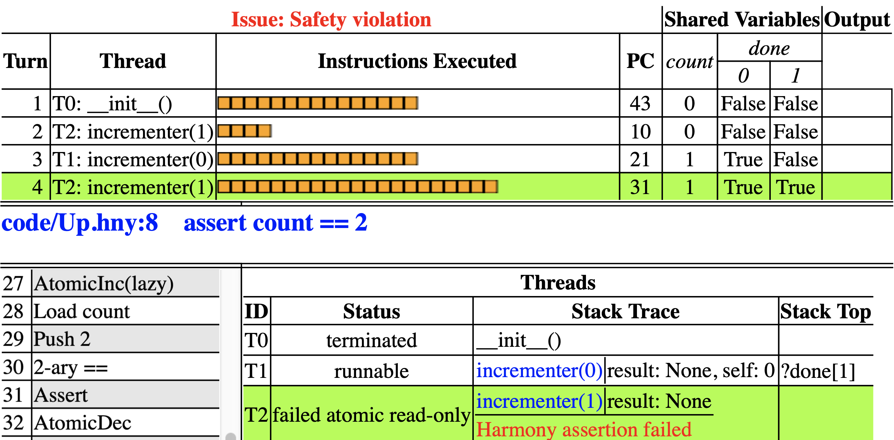

# The Harmony Virtual Machine 

Harmony programs are compiled to Harmony *bytecode* (a list of machine
instructions for a virtual machine), which in turn is executed by the
Harmony virtual machine (HVM). The Harmony compiler places the bytecode
for file *x*.`htm` in file *x*.`hvm`. The model checker, called *Charm*,
executes the code in *x*.`htm` and places its output in a file called
*x*.`hco` and a stylized version of the same output in an HTML file
called *x*.`htm`.

To understand the problem of concurrent computing, it is important to
have a basic understanding of machine instructions, and in our case
those of the HVM.

## Harmony Values 

Harmony programs, and indeed the HVM, manipulate Harmony values. Harmony
values are recursively defined: they include booleans (`False` and
`True`), integers (but not floating point numbers), strings (enclosed by
single or double quotes), sets of Harmony values, and dictionaries that
map Harmony values to other Harmony values. Strings that start with a
letter or an underscore and only contain letters, digits, and
underscores can be written without quotes by preceding it with a dot.
So, .*example* is the same string as `"`example`"`.

Harmony makes extensive use of dictionaries. A dictionary maps keys to
values. Unlike Python, which requires that keys must be hashable, any
Harmony value can be a key, including another dictionary. Dictionaries
are written as $\{ k_0: v_0, ~ k_1: v_1, ~ ... \}$. If *d* is a
dictionary, and *k* is a key, then the following expression retrieves
the Harmony value that *k* maps to in *d*:
```
d k
```
The meaning of *d* *a* *b* $...$ is (((*d* *a*) *b*) $...$). This
notation is unfamiliar to Python programmers, but in Harmony square
brackets can be used in the same way as parentheses, so you can express
the same thing in the form that is familiar to Python programmers:
```
d[k]
```
However, if *d* = { .*count*: 3 }, then you can write *d*.*count* (which
has value 3) instead of having to write *d*\[.*count*\] or
*d*\[`"`count`"`\] (although any of those will work). Thus a dictionary
can be made to look much like a Python object.

Tuples are special forms of dictionaries where the keys are the indexes
into the tuple. For example, the tuple (5, `False`) is the same Harmony
value as { 0:5, 1:`False` }. The empty tuple is written as (). As in
Python, you can create singleton tuples by including a comma. For
example, (1,) is a tuple consisting just of the number 1. Importantly,
$(1) = 1 \ne (1,) = \{ 0:1 \}$.

Again, square brackets and parentheses work the same in Harmony, so
\[*a*, *b*, *c*\] (which looks like a Python list) is the same Harmony
value as (*a*, *b*, *c*) (which looks like a Python tuple), which in
turn is the same Harmony value as { 0:*a*, 1:*b*, 2:*c* }. So, if *x* =
\[`False`, `True`\], then *x*\[0\] = `False` and *x*\[1\] = `True`, just
like in Python. However, when creating a singleton list, make sure you
include the comma, as in \[`False`,\]. The expression \[`False`\] just
means `False`.

Harmony is not an object-oriented language, so objects don't have
built-in methods. However, Harmony does have some powerful operators to
make up for some of that. For example, dictionaries have two handy unary
operators. If *d* is a dictionary, then **keys** *d* (or equivalently
**keys**(*d*)) returns the set of keys and **len** *d* returns the size
of this set.

[Value Types and Operators](values.md#value-types-and-operators) provides details on all the types of values that Harmony currently
supports.

## Harmony Bytecode 

A Harmony program is translated into HVM bytecode. To make it amenable
to efficient model checking, the HVM is not an ordinary virtual machine,
but its architecture is nonetheless representative of conventional
computers and virtual machines such as the Java Virtual Machine.

Instead of bits and bytes, a HVM manipulates Harmony values. A HVM has
the following components:

-   Code: This is an immutable and finite list of HVM instructions,
    generated from a Harmony program. The types of instructions will be
    described later.

-   Shared memory: A HVM has just one memory location containing a
    Harmony value.

-   Threads: Any thread can spawn an unbounded number of other threads
    and threads may terminate. Each thread has a program counter that
    indexes into the code, a stack of Harmony values, and a private
    *register* that contains a Harmony value.[^2]

The register of a thread contains the local variables of the method that
the thread is currently executing. It is saved and restored by method
invocations. The state of a thread is called a *context* (aka
*continuation*): it contains the values of its program counter, stack,
and registers. The HVM state consists of the value of its memory and the
multiset (or *bag*) of contexts. It is a multiset of contexts because
two threads can have the same context at the same time.

       0 Frame __init__ ()
    code/Up.hny:1 count = 0
       1 Push 0
       2 Store count
    code/Up.hny:2 done = [ False, False ]
       3 Push [False, False]
       4 Store done
    code/Up.hny:4 def incrementer(self):
       5 Jump 35
       6 Frame incrementer self
    code/Up.hny:5     count = count + 1
       7 Load count
       8 Push 1
       9 2-ary +
       10 Store count

<figcaption>Figure 4.1: The first part of the HVM bytecode corresponding to Figure 3.2</figcaption>

It may seem strange that there is only one memory location. However,
this is not a limitation because Harmony values are unbounded trees. The
shared memory is a dictionary that maps strings (names of shared
variables) to other Harmony values. We call this a *directory*. Thus, a
directory represents the state of a collection of variables named by the
strings. Because directories are Harmony values themselves, directories
can be organized into a tree. Each node in a directory tree is then
identified by a sequence of Harmony values, like a path name in the file
system hierarchy. We call such a sequence an *address*. For example, in
Figure 3.2 the memory is a dictionary with two entries: .*count* and
*done*. And the value of entry *done* is a dictionary with keys 0 and 1.
So, for example, the address of *done*\[0\] is the sequence \[*done*,
0\]. An address is itself a Harmony value.

Compiling the code in Figure 3.2 results in the HVM bytecode listed in
Figure 4.1. You can obtain this code by invoking `harmony` with the
`-a` flag like so:

    harmony -a Up.hny

Each thread in the HVM is predominantly a *stack machine*, but it also a
register. Like shared memory, the register contains a dictionary so it
can represent the values of multiple named variables. All instructions
are atomically executed. The Harmony memory model is *sequentially
consistent*: all accesses are in program order. Most instructions pop
values from the stack or push values onto the stack. At first there is
one thread, named `__init__`, which initializes the state. It starts
executing at instruction 0 and keeps executing until it reaches the last
instruction in the program. In this case, it executes instructions 0
through 5 first. The last instruction in that sequence is a `JUMP`
instruction that sets the program counter to 35 (skipping over the code
for `incrementer` method). The `__init__` thread then executes the
remaining instructions and finishes. Once initialization completes, any
threads that were spawned (in this case `incrementer`(0) and
`incrementer(1)`) can run.

    #states 44 (time 0.001+0.001)
    Safety Violation
    T0: __init__()     [0-5,35-43]   { count: 0, done: [ False, False ] }
    T2: incrementer(1) [6-9]         { count: 0, done: [ False, False ] }
    T1: incrementer(0) [6-20]        { count: 1, done: [ True,  False ] }
    T2: incrementer(1) [10-24,26-31] { count: 1, done: [ True,  True  ] }
    Harmony assertion failed
    open code/Up.htm for more information

<figcaption>Figure 4.2: The text output of running Harmony on Figure 3.2</figcaption>

At program counter 6 is the code for the `incrementer` method. All
methods start with a `Frame` instruction and end with a `Return`
instruction. provides a list of all HVM machine instructions, in case
you want to read about the details. The `Frame` instruction lists the
name of the method and the names of its arguments. The code generated
from $\mathit{count} := \mathit{count} + 1$ in line 5 of `Up.hny` is as
follows (see Figure 4.1):

7.  The `Load` instruction pushes the value of the *count* variable onto
    the stack.

8.  The `Push` instruction pushes the constant 1 onto the stack of the
    thread.

9.  `2-ary` is a `+` operation with 2 arguments. It pops two values from
    the stack (the value of *count* and 1), adds them, and pushes the
    result back onto the stack.

10. The `Store` instruction pops a Harmony value (the sum of the *count*
    variable and 1) and stores it in the *count* variable.

You can think of Harmony as trying every possible interleaving of
threads executing instructions. Figure 4.2 shows the output
produced by running Harmony on the `Up.hny` program.

Harmony can report the following failure types:

-   `Safety violation`: This means something went wrong with at least
    one of the executions of the program that it tried. This can include
    a failing assertion, behavior violations, divide by zero, using an
    uninitialized or non-existent variable, dividing a set by an
    integer, and so on. Harmony will print a trace of the shortest bad
    execution that it found.

-   `Non-terminating State`: Harmony found one or more states from which
    there does not exist an execution such that all threads terminate.
    Harmony will not only print the non-terminating state with the
    shortest trace, but also the list of threads at that state, along
    with their program counters.

-   `Behavior Violation`: The program can terminate in a state not
    allowed by the behavioral specification ([Chapter 13](testing.md)).

-   `Active Busy Waiting`: There are states in which some thread cannot
    make progress without the help of another thread, but does not block
    ([Chapter 15](condwait.md)).

-   `Data Race`: There are states in which two or more threads
    concurrently access a shared variable, at least one of which is a
    store operation ([Chapter 10](synch.md)).

Harmony checks for these types of failure conditions in the given order:
if there are multiple failure conditions, only the first is reported.
*Active busy waiting* ([Chapter 15](condwait.md)) is not technically an indication
of a synchronization problem, but instead an indication of an
inefficient solution to a synchronization problem--- one that uses up
CPU cycles unnecessarily. A *data race* may not be a bug
either---whether or not it is might depend on the semantics of the
underlying memory operations and are therefore generally undesirable.
Harmony may also warn about behaviors, in particular if the generated
behavior is only a subset of the provided behavior.

Going back to our example, Harmony reports a safety violation. In
particular, it reports that an assertion failed. The program got to the
failed assertion in four "turns." The output has four columns:

1.  A thread identifier;

2.  The main method and argument of the thread;

3.  The sequence of program counters of the HVM instructions that the
    thread executed;

4.  The contents of the shared memory.




The four turns in the execution are as follows:

1.  Thread `__init__` (with identifier T0) executes instructions 0
    through 5 and 35 through 43, setting shared variable *count* to 0
    and shared variable *done* to \[`False`, `False`\].

2.  Thread `incrementer(1)` (with identifier T1) executes instructions 6
    through 20, storing 1 into *count* and storing `True` into
    *done*\[1\];

3.  Thread `incrementer(0)` (with identifier T2) executes instructions 6
    through 9, loading the value of *count* but stopping just before 
    storing 1 into *count*;

4.  Thread `incrementer`(0) (T2) continues execution, executing
    instructions 10 through 24 storing value 1 into *count* (instruction
    10), storing `True` into *done*\[0\], finding that *done*\[1\] is
    `True`, and finally detecting that the assertion is violated.

Harmony also generates an HTML file that allows exploring more details
of the execution interactively. Open the suggested HTML file and you
should see something like Figure 4.3.

In the top right, the HTML file contains the reported issue in red.
Underneath it, a table shows the four turns in the execution. Instead of
listing explicitly the program counters of the executed instructions,
the HTML file contains a list of blocks for each executed instruction.
We call this the *timeline*. You can click on such a block to see the
state of the Harmony virtual machine just after executing the
corresponding instruction. The turn that is being executed is
highlighted in green. The table also lists the program counter of the
thread at each turn, the values of the shared variables, and any values
the thread may have printed (none in this case). Underneath the table it
shows the line of Harmony code that is being executed in blue.

The bottom left shows the bytecode of the program being executed. It has
alternating grey and white sections. Each section corresponds to a line
of Harmony code. The instruction that is about to be executed, if any,
is highlighted in red. (In this case, the state shown is a failed state
and no instruction will be executed next.) If you hover the mouse over a
machine instruction, it provides a brief explanation of what the
instruction does.

The bottom right contains a table with the state of each thread. The
thread that is executing is highlighted in green. Status information for
a thread can include:

-   `runnable`: the thread is runnable but not currently running. In
    Harmony, threads are interleaved and so at most one thread is
    actually running;

-   `running`: the thread is currently executing instructions;

-   `terminated`: the thread has completed all its instructions;

-   `failed`: the thread has encountered an error, such as violating an
    assertion or divide by zero;

-   `blocked`: the thread cannot make progress until another thread has
    updated the shared state. For example, this occurs when one of the
    implementers is waiting for the other to set its *done* flag;

-   `atomic`: the thread is in *atomic* mode, not allowing other threads
    to be scheduled. This is, for example, the case when an assertion is
    being checked;

-   `read-only`: the thread is in *read-only* mode, not able to modify
    shared state. Assertions can execute arbitrary code including
    methods, but they are not allowed to modify the shared state.

The stack of each thread is subdivided into two parts: the *stack trace*
and the *stack top*. A stack trace is a list of methods that are being
invoked. In this case, the `incrementer` method does not invoke any
other methods, and so the list is of length 1. For each entry in the
stack trace, it shows the method name and arguments, as well as the
variables of the method. The stack top shows the values on the stack
beyond the stack trace.

When you load the HTML file, it shows the state after executing the last
instruction. As mentioned above, you can go to any point in the
execution by clicking on one of the blocks in the timeline. There are
also various handy keyboard shortcuts:

           *Right arrow*: go to the next instruction;
            *Left arrow*: go to the previous instruction;
            *Down arrow*: go to the next turn;
              *Up arrow*: go to the previous turn;
    *Enter (aka Return)*: go to the next line of Harmony code;
                     *0*: go to the initial state.

If you want to see an animation of the entire execution, one instruction
at a time, you can first hit 0 and then hold down the right arrow. If
you want to see it one line of Harmony code at a time, hold down the
enter (aka return) key instead. If you hold down the down arrow key, the
movie will go by very quickly.

## Exercises 


**4.1** Figure 4.4 shows an attempt at trying to fix the code of
Figure 3.2. Run it through Harmony and see what happens. Based on the
error output, describe in English what is wrong with the code by
describing, in broad steps, how running the program can get into a bad
state.

**4.2** What if we moved line 5 of Figure 4.4 to after the **if**
statement (between lines 7 and 8)? Do you think that would work? Run it
through Harmony and describe either why it works or why it does not
work.


```python title="UpEnter.hny"
--8<-- "UpEnter.hny"
```

<figcaption>Figure 4.4 (<a href=https://harmony.cs.cornell.edu/code/UpEnter.hny>code/UpEnter.hny</a>): Incorrect attempt at fixing the code of Figure 3.2</figcaption>
