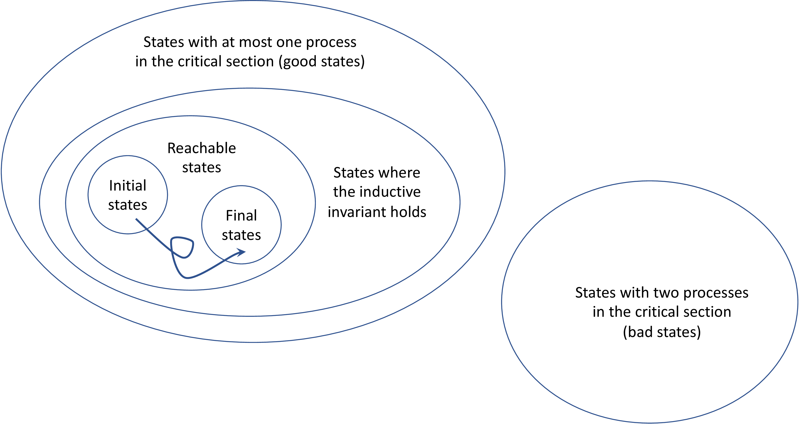

# Peterson's Algorithm 

```python title="Peterson.hny"
sequential flags, turn
flags = [ False, False ]
turn = choose({0, 1})

def thread(self):
    while choose({ False, True }):
        # Enter critical section
        flags[self] = True
        turn = 1 - self
        await (not flags[1 - self]) or (turn == self)
        # Critical section is here
        cs: assert countLabel(cs) == 1
        # Leave critical section
        flags[self] = False
spawn thread(0)
spawn thread(1)
```

<figcaption>Figure 6.1 (<a href=https://harmony.cs.cornell.edu/code/Peterson.hny>code/Peterson.hny</a>): 
Peterson's Algorithm </figcaption>

In 1981, Gary L. Peterson came up with a beautiful solution to the
mutual exclusion problem, now known as "Peterson's
Algorithm". The algorithm is an amalgam of the (incorrect)
algorithms in Figure 5.4 and Figure 5.5, and is presented
in Figure 6.1. (The first line specifies that the *flags* and
*turn* variables are assumed to satisfy *sequential consistency*---it
prevents Harmony from complaining about data races involving these
variables, explained in [Chapter 9](spinlock.md).)

A thread first indicates its interest in entering the critical section
by setting its flag. It then politely gives way to the other thread
should it also want to enter the critical section---if both do so at the
same time one will win because writes to memory in Harmony are atomic.
The thread continues to be polite, waiting until either the other thread
is nowhere near the critical section (*flag*\[1 -- *self*\] = `False`)
or has given way (*turn* = *self*). Running the algorithm with Harmony
shows that it satisfies both mutual exclusion and progress.

 
<figcaption>Figure 6.2 (Venn diagram classifying all states and a trace </figcaption>

Why does it work? We will focus here on how one might go about proving
mutual exclusion for an algorithm such as Peterson's. It turns out that
doing so is not easy. If you are interested in learning more about
concurrent programming but not necessarily in how to prove concurrent
programs correct, you may choose to skip the rest of this chapter. If
you are still here, you have to understand a little bit more about how
the Harmony virtual machine (HVM) works. In [Chapter 4](harmonymachine.md) we
talked about the concept of *state*: at any point in time the HVM is in
a specific state. A state is comprised of the values of the shared
variables as well as the values of the thread variables of each thread,
including its program counter and the contents of its stack. Each time a
thread executes a HVM machine instruction, the state changes (if only
because the program counter of the thread changes). We call that a
*step*. Steps in Harmony are atomic.

The HVM starts in an initial state in which there is only one thread
(`__init__`()) and its program counter is 0. A *trace* is a sequence of
steps starting from the initial state, resulting in a sequence of
states. When making a step, there are two sources of non-determinism in
Harmony. One is when there is more than one thread that can make a step.
The other is when a thread executes a **choose** operation and there is
more than one choice. Because there is non-determinism, there are
multiple possible traces. We call a state *reachable* if it is either
the initial state or it can be reached from the initial state through a
finite trace. A state is final when there are no threads left to make
state changes.

It is often useful to classify states. *Initial*, *final*, and
*reachable*, and *unreachable* are all examples of classes of states.
Figure 6.2 depicts a Venn diagram of various classes of states and a
trace. One way to classify states is to define a predicate over states.
All states in which *x* = 1, or all states where there are two or more
threads executing, are examples of such predicates. For our purposes, it
is useful to define a predicate that says that at most one thread is in
the critical section. We shall call such states *exclusive*.

An *invariant* of a program is a predicate that holds over all states
that are reachable by that program. We want to show that exclusivity is
an invariant because mutual exclusion means that all reachable states
are exclusive. In other words, we want to show that the set of reachable
states of executing the program is a subset of the set of states where
there is at most one thread in the critical section.

One way to prove that a predicate is an invariant is through induction
on the number of steps. First you prove that the predicate holds over
the initial state. Then you prove that for every reachable state, and
for every step from that reachable state, the predicate also holds over
the resulting state. For this to work you would need a predicate that
describes exactly which states are reachable. But we do not have such a
predicate: we know how to define the set of reachable states
inductively, but---given an arbitrary state---it is not easy to see
whether it is reachable or not.

To solve this problem, we will use what is called an *inductive
invariant*. An inductive invariant $\mathcal{I}$ is a predicate over
states that satisfies the following:

-   $\mathcal{I}$ holds in the initial state.

-   For any state in which $\mathcal{I}$ holds (including unreachable
    ones) and for any thread in the state, if the thread takes a step,
    then $\mathcal{I}$ also holds in the resulting state.

One candidate for such a predicate is exclusivity itself. After all, it
certainly holds over the initial state. And as Harmony has already
determined, exclusivity is an invariant: it holds over every reachable
state. Unfortunately, exclusivity is not an *inductive* invariant. To
see why, consider the following state *s*: let thread 0 be at label `cs`
and thread 1 be at the start of the **await** statement. Also, in state
*s*, $\mathit{turn} = 1$. Now let thread 1 make a step. Because
$\mathit{turn} = 1$, thread 1 will stop waiting and also enter the
critical section, entering a state that is not exclusive. So,
exclusivity is an invariant (holds over every reachable state, as
demonstrated by Harmony), but not an inductive invariant. It will turn
out that *s* is not reachable.

We are looking for an inductive invariant that *implies* exclusivity. In
other words, the set of states where the inductive invariant holds must
be a subset of the set of states where there is at most one thread in
the critical section.

Let us begin with considering the following important property:
$\mathcal{F}(i) = \mathtt{thread}(i)@[10 \cdots 17] \Rightarrow \mathit{flags}[i]$,
that is, if thread *i* is executing in lines 10 through 17, then
$\mathit{flags}[i]$ is set. Although it does not, by itself, imply
exclusivity, we can show that $\mathcal{F}(i)$ is an inductive invariant
(for both threads 0 and 1). To wit, it holds in the initial state,
because in the initial state thread *i* does not even exist yet. Now we
have to show that if $\mathcal{F}(i)$ holds in some state, then
$\mathcal{F}(i)$ also holds in a next state. Since only thread *i* ever
changes $\mathit{flags}[i]$, we only need to consider steps by
thread *i*. Since $\mathcal{F}(i)$ holds, there are two cases to
consider:

1.  states in which $\mathit{flags}[i] = \texttt{true}$

2.  states in which $\lnot \mathtt{thread}(i)@[10 \cdots 17]$ (because
    false implies anything)

In each case, we need to show that if thread *i* takes a step, then
$\mathcal{F}(i)$ still holds. In the first case, there is only one step
that thread *i* can take that would set $\mathit{flags}[i]$ to false:
the step from line 17 to line 18. But executing the line would also take
the thread out of lines $10 \cdots 17$, so $\mathcal{F}(i)$ continues to
hold. In the second case (thread *i* is not executing in lines
$10 \cdots 17$), the only step that would cause thread *i* to execute in
lines $10 \cdots 17$ would be the step in line 9. But in that case
$\mathit{flags}[i]$ would end up being true, so $\mathcal{F}(i)$
continues to hold as well. So, $\mathcal{F}(i)$ is an inductive
invariant (for both threads 0 and 1).

While $\mathcal{F}(i)$ does not imply mutual exclusion, it does imply
the following useful invariant:
$\mathtt{thread}(i)@cs \Rightarrow \mathit{flags}[i]$: when thread *i*
is at the critical section, $\mathit{flags}[i]$ is set. This seems
obvious from the code, but now you know how to prove it. We will use a
similar technique to prove the exclusivity is invariant.

We need a stronger inductive invariant than $\mathcal{F}(i)$ to prove
mutual exclusion. What else do we know when thread *i* is in the
critical section? Let
$\mathcal{C}(i) = \lnot\mathit{flags}[1 - i] \lor \mathit{turn} = i$,
that is, the condition on the **await** statement for thread *i*. In a
sequential program, $\mathcal{C}(i)$ would clearly hold if thread *i* is
in the critical section:
$\mathtt{thread}(i)@cs \Rightarrow \mathcal{C}(i)$. However, because
thread $1-i$ is executing concurrently, this property does not hold. You
can use Harmony to verify this. Just place the following command in the
critical section of the program:

**assert** (**not** *flags*\[1 -- *self*\]) **or** (*turn* == *self*)


```python title="PetersonInductive.hny"
sequential flags, turn
flags = [ False, False ]
turn = choose({0, 1})

def thread(self):
    while choose({ False, True }):
        # Enter critical section
        flags[self] = True
        gate: turn = 1 - self
        await (not flags[1 - self]) or (turn == self)
        # Critical section
        cs: assert (not flags[1 - self]) or (turn == self) or
(countLabel(gate) == 1)
        # Leave critical section
        flags[self] = False
spawn thread(0)
spawn thread(1)
```

<figcaption>Figure 6.3 (
<a href=https://harmony.cs.cornell.edu/code/PetersonInductive.hny>code/PetersonInductive.hny</a>): 
Peterson's Algorithm with Inductive Invariant
</figcaption>

When running Harmony, this assertion will fail. You can check the HTML
output to see what happened. Suppose thread 0 is at the critical
section, $\mathit{flags}[0]$ = true, $\mathit{turn} = 1$, and thread 1
just finished the step in line 7, setting $\mathit{flags}[1]$ to true.
Then $C(0)$ is violated. But it suggests a new property:
$\mathcal{G}(i) =
\mathtt{thread}(i)@\mathtt{cs} \Rightarrow \mathcal{C}(i) \lor \mathtt{thread}(1-i)@10$.
That is, if thread *i* is at the critical section, then either
$\mathcal{C}(i)$ holds or thread $1-i$ is about to execute line 10.
Figure 6.3 formalizes $\mathcal{G}(i)$ in Harmony. The label
`gate` refers to line 10, that is, the step that sets *turn* to $1-i$.
You can run Figure 6.3 to determine that $\mathcal{G}(i)$ is
an invariant for $i = 0, 1$. Moreover, if $\mathcal{F}(i)$ and
$\mathcal{G}(i)$ both hold for $i = 0, 1$, then mutual exclusion holds.
We can show this using proof by contradiction. Suppose mutual exclusion
is violated and thus both threads are in the critical section. By
$\mathcal{F}$ it must be the case that both *flags* are true. By
$\mathcal{G}$ and the fact that neither thread is at label `gate`, we
know that both $C(0)$ and $C(1)$ must hold. This then implies that
$\mathit{turn} = 0 \land \mathit{turn} = 1$, providing the desired
contradiction.

We claim that $\mathcal{G}(i)$ is an inductive invariant. First, since
neither thread in in the critical section in the initial state, it is
clear that $\mathcal{G}(i)$ holds in the initial state. Without loss of
generality, suppose $i=0$ (a benefit from the fact that the algorithm is
symmetric for both threads). We still have to show that if we are in a
state in which $\mathcal{G}(0)$ holds, then any step will result in a
state in which $\mathcal{G}(0)$ still holds.

First consider the case that thread 0 is at label `cs`. If thread 0 were
to take a step, then in the next state thread 0 would be no longer at
that label and $\mathcal{G}(0)$ would hold trivially over the next
state. Therefore we only need to consider a step by thread 1. From
$\mathcal{G}$ we know that one of the following three cases must hold
before thread 1 takes a step:

1.  *flags*\[1\] = `False`;

2.  *turn* = 0;

3.  thread 1 is at label `gate`.

Let us consider each of these cases. We have to show that if thread 1
takes a step, then one of those cases must hold after the step. In the
first case, if thread 1 takes a step, there are two possibilities:
either $flags[1]$ will still be `False` (in which case the first case
continues to hold), or $flags[1]$ will be `True` and thread 1 will be at
label `gate` (in which case the third case will hold). We know that
thread 1 never sets *turn* to 1, so if the second case holds before the
step, it will also hold after the step. Finally, if thread 1 is at label
`gate` before the step, then after the step *turn* will equal 0, and
therefore the second case will hold after the step.

Now consider the case where thread 0 is not in the critical section, and
therefore $\mathcal{G}(0)$ holds trivially because false implies
anything. There are three cases to consider:

1.  Thread 1 takes a step. But then thread 0 is still not in the
    critical section and $\mathcal{G}(0)$ continues to hold;

2.  Thread 0 takes a step but still is not in the critical section. Then
    again $\mathcal{G}(0)$ continues to hold.

3.  Thread 0 takes a step and ends up in the critical section. Because
    thread 0 entered the critical section, we know that
    $\mathit{flags}[1] = \texttt{False}$ or $\mathit{turn} = 0$ because
    of the `await` condition. And hence $\mathcal{G}(0)$ continues to
    hold in that case as well.

We have now demonstrated mutual exclusion in Peterson's Algorithm in two
different ways: one by letting Harmony explore all possible executions,
the other using inductive invariants and proof by induction. The former
is certainly easier, but it does not provide intuition for why the
algorithm works. The second provides much more insight.

Even though they are not strictly necessary, we encourage you to include
invariants in your Harmony code. They can provide important insights
into why the code works.

A cool anecdote is the following. When the author of Harmony had to
teach Peterson's Algorithm, he refreshed his memory by looking at the
Wikipedia page. The page claimed that the following predicate is
invariant: if thread *i* is in the critical section, then
$\mathcal{C}(i)$ (i.e., $\mathcal{G}$ without the disjunct that thread
$1-i$ is at label `gate`). We already saw that this is not an invariant.
(The author fixed the Wikipedia page with the help of Fred
B. Schneider.)

This anecdote suggests the following. If you need to do a proof by
induction of an algorithm, you have to come up with an inductive
invariant. Before trying to prove the algorithm, you can check that the
predicate is at least invariant by testing it using Harmony. Doing so
could potentially avoid wasting your time on a proof that will not work
because the predicate is not invariant, and therefore not an inductive
invariant either. Moreover, analyzing the counterexample provided by
Harmony may well suggest how to fix the predicate.

## Exercises 

```python title="csonebit.hny"
sequential flags
flags = [ False, False ]

def thread(self):
    while choose({ False, True }):
        # Enter critical section
        flags[self] = True
        while flags[1 - self]:
            flags[self] = False
            flags[self] = True
        
        # Critical section
        cs: assert countLabel(cs) == 1
        # Leave critical section
        flags[self] = False
spawn thread(0)
spawn thread(1)
```

<figcaption>Figure 6.4 (<a href=https://harmony.cs.cornell.edu/code/csonebit.hny>code/csonebit.hny</a>): 
Mutual exclusion using a flag per thread </figcaption>

**6.1** Figure 6.4 presents another solution to the mutual exclusion
problem. It is similar to the one in Figure 5.4, but has a
thread *back out and try again* if it finds that the other thread is
either trying to enter the critical section or already has. Compare this
algorithm with Peterson's. Why does Harmony complain about *active busy
waiting*?

**6.2** Can you find one or more inductive invariants for the algorithm in
Figure 6.4 to prove it correct? Here's a pseudo-code version of
the algorithm to help you. Each line is an atomic action:

        initially: flagX = flagY = False

        thread X:                          thread Y:
            X0: flagX = True                   Y0: flagY = True
            X1: if not flagY goto X4           Y1: if not flagX goto Y4
            X2: flagX = False                  Y2: flagY = False
            X3: goto X0                        Y3: goto Y0
            X4: ...critical section...         Y4: ...critical section...
            X5: flagX = False                  Y5: flagY = False

**6.3** A colleague of the author asked if the first two assignments in Peterson's algorithm
(setting *flags*\[*self*\] to `True` and *turn* to 1 -- *self* can be
reversed. After all, they are different variables assigned independent
values---in a sequential program one could surely swap the two
assignments. See if you can figure out for yourself if the two
assignments can be reversed. Then run the program in Figure 6.1
after reversing the two assignments and describe in English what
happens.

**6.4** Bonus question: Can you generalize Peterson's algorithm to more than two
threads?

**6.5** Bonus question: Implement [Dekker's
Algorithm](https://en.wikipedia.org/wiki/Dekker%27s_algorithm),
[Eisenstein and McGuire's
Algorithm](https://en.wikipedia.org/wiki/Eisenberg_%26_McGuire_algorithm),
[Szymański's
Algorithm](https://en.wikipedia.org/wiki/Szymanski%27s_algorithm), or
the [Lamport's Bakery
Algorithm](https://en.wikipedia.org/wiki/Lamport%27s_bakery_algorithm).
Note that the last one uses unbounded state, so you should modify the
threads so they only try to enter the critical section a bounded number
of times.
