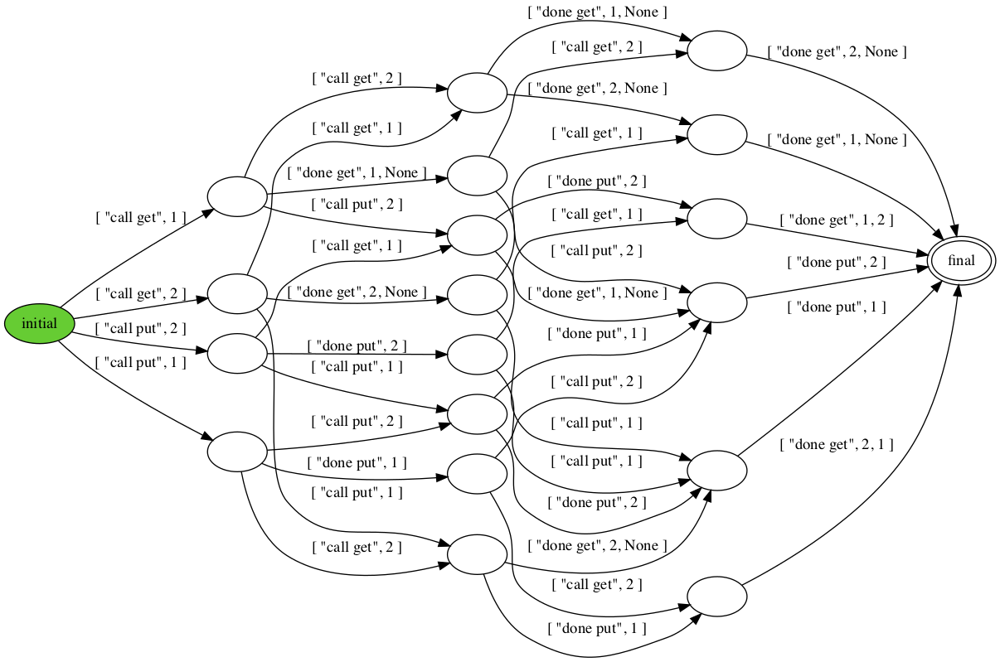

# Testing: Checking Behaviors 


```python title="qtestseq.hny"
import queue, queueconc
const NOPS = 4
const VALUES = { 1..NOPS }
specq = queue.Queue()
implq = queueconc.Queue()
for i in {1..NOPS}:
    let op = choose({ "get", "put" }):
        if op == "put":
            let v = choose(VALUES):
                queueconc.put(?implq, v)
                queue.put(?specq, v)
        else:
            let v = queueconc.get(?implq)
            let w = queue.get(?specq):
                assert v == w
```

<figcaption>Figure 13.1 (<a href=https://harmony.cs.cornell.edu/code/qtestseq.hny>code/qtestseq.hny</a>): 
Sequential queue test </figcaption>

Testing is a way to increase confidence in the correctness of an
implementation. Figure 11.2 demonstrates how concurrent queues may
be used, but it is not a very thorough test program for an
implementation such as the one in Figure 11.3 and does little to
increase our confidence in its correctness. To wit, if `get()` always
returned 1, the program would find no problems. Similarly,
Figure 12.2 is not a good test program for something as
complicated as Figure 12.3. In this chapter, we will look at
approaches to testing concurrent code.

As with critical sections---when testing a concurrent data
structure---we need a specification. For example, Figure 11.1(a)
shows a sequential specification of a queue in Harmony. First, we can
check if the queue implementation in Figure 11.3 meets the
sequential queue specification in Figure 11.1(a). To check if the
queue implementation meets the specification, we need to see if any
sequence of queue operations in the implementation matches a
corresponding sequence in the specification. We say that the
implementation and the specification have the same *behaviors* or are
*behaviorally equivalent*.

Behaviors say something about how we got to a state. The same state can
be reaching by multiple behaviors, and the behaviors are often an
integral part of whether a program is correct or not. Just because a
state satisfies some invariant---however important---does not mean that
the state is valid given the sequence of operations. For example, a
state in which the queue is empty is certainly a valid state in its own
right, but if the last operation to get there was an enqueue operation,
there must be a bug in the program. It can therefore be important to
capture the behaviors. We could store behaviors in the state itself by
adding what is known as a *history variable* that keeps track of all the
operations. While this can be useful for correctness proofs, for model
checking this approach presents a problem: introducing this additional
state can lead to state explosion or even turn a finite model (a model
with a finite number of states) into an infinite one. We therefore use a
different approach: composing an implementation with its specification
to ensure that accept the same behaviors.

Figure 13.1 presents a test program that does exactly this, for
sequences of up to `NOPS` queue operations. It maintains two queues:

-   *specq*: the queue of the specification;

-   *implq*: the queue of the implementation.

For each operation, the code first chooses whether to perform a `get` or
`put` operation. In the case of a `put` operation, the code also chooses
which value to append to the queue. All operations are performed on both
the queue implementation and the queue specification. In the case of
`get`, the results of the operation on both the implementation and
specification are checked against one another.

*Test programs themselves should be tested*. Just because a test program
works with a particular implementation does not mean the implementation
is correct---it may be that the implementation is incorrect but the test
program does not have enough coverage to find any bugs in the
implementation. So, run a test program like this with a variety of queue
implementations that have known bugs in them and make sure that the test
program finds them. Conversely, a test program may be broken in that it
finds bugs that do not exist. In my experience, it is often harder to
implement the test program than the algorithm that the test program
tests.

As with any other test program, Figure 13.1 may not trigger extant
bugs, but it nonetheless inspires reasonable confidence that the queue
implementation is correct, at least sequentially. The higher `NOPS`, the
higher the confidence. It is possible to write similar programs in other
languages such as Python, but the **choose** expression in Harmony makes
it relatively easy to explore all corner cases. For example, a common
programming mistake is to forget to update the `tail` pointer in `get()`
in case the queue becomes empty. Normally, it is a surprisingly tricky
bug to find. You can comment out those lines in Figure 11.3 and
run the test program---it should easily find the bug and explain exactly
how the bug manifests itself, adding confidence that the test program is
reasonably thorough.

The test program also finds some common mistakes in using locks, such as
forgetting to release a lock when the queue is empty, but it is not
designed to find concurrency bugs in general. If you remove all
`acquire()` and `release()` calls from Figure 11.3, the test
program will not (and should not) find any errors, but it would be an
incorrect implementation of a concurrent queue.

The next step is to test if the queue implementation meets the
*concurrent* queue specification or not. Figure 11.1(b) shows the
concurrent queue specification. It is similar to the sequential
specification in Figure 11.1(a) but makes all operations (except
instantiation itself) atomic. Testing the implementation of a concurrent
queue specification is trickier than testing the implementation of a
sequential one because there are many more scenarios to check.

We would like a way that---similar to the sequential
test---systematically compares behaviors of the concurrent queue
implementation with behaviors of the concurrent queue specification. But
we cannot do this by composing the specification and the implementation
and simply run the same test operations on both as we did
before---concurrency make the operations non-determistic and thus the
specification and implementation of a single execution might produce
different results, even if both are correct. Instead, we will create a
test program that tries various concurrent combinations of queue
operations, and run it twice: once against the specification of the
concurrent queue and once against the implementation. We will then check
if the behaviors obtained from running the implementation are also
behaviors obtained from the specification.




```python title="qtestpar.hny"
import queue

const NOPS = 4
q = queue.Queue()

def put_test(self):
    print("call put", self)
    queue.put(?q, self)
    print("done put", self)

def get_test(self):
    print("call get", self)
    let v = queue.get(?q):
        print("done get", self, v)

nputs = choose {1..NOPS-1}
for i in {1..nputs}:
    spawn put_test(i)
for i in {1..NOPS-nputs}:
    spawn get_test(i)
```

<figcaption>Figure 13.2 (<a href=https://harmony.cs.cornell.edu/code/qtestpar.hny>code/qtestpar.hny</a>): 
Concurrent queue test. The behavior DFA is for NOPS = 2. </figcaption>


```python title="queueseq.hny"
def Queue():
    result = { .data: [ ], .head: 0, .tail: 0 }

def put(q, v):
    let i = q->tail:
        q->data[i] = v
        q->tail = i + 1

def get(q):
    let i = q->head:
        if i == q->tail:
            result = None
        else:
            result = q->data[i]
            q->head = i + 1
```

<figcaption>Figure 13.3 (<a href=https://harmony.cs.cornell.edu/code/queueseq.hny>code/queueseq.hny</a>): 
Sequential but not a concurrent queue implementation </figcaption>


We will start with a test program that tries concurrent combinations of
various queue operations. Figure 13.2 shows the test program. It
starts `NOPS` threads doing either a `put`
or a `get` operation.  It selects the fraction of `put`
over `get` operations nondetermistically, although avoiding the
uninteresting case in which there are none of one of them.
In case of a `put` operation, the thread enqueues its own
name (which is provided as an argument to the thread). In order to
capture the behaviors, each thread prints what operation it is about to
perform, and afterwards it prints that the operation has completed
(including the return value if any). This is probably much like you
would do if you were trying to find a bug in a program.

Figure 13.2 also shows the deterministic finite automaton that
describes the possible outputs when the test program is run against the
specification in the case `NOPS` = 2---for `NOPS` = 4 it would be much
too large to print here. Since there are no cycles in the DFA, you can
follow some paths through this DFA and see that they are valid
interleavings of the threads. You can obtain this output yourself by
running

    $ harmony -c NOPS=2 -o spec.png code/qtestpar.hny

If you run the same test program against the implementation of
Figure 11.3, you will get the same output:

    $ harmony -c NOPS=2 -o impl.png -m queue=queueconc code/qtestpar.hny

You can try this for various `NOPS`, although it gets increasingly
harder to check by hand that the generated DFAs are the same as `NOPS`
increases. Now run the test program against Figure 13.3, which is
clearly an incorrect implementation of the concurrent queue
specification because it contains no synchronization code. However,
Harmony does not immediately detect any problems. In fact, for
$\mathtt{NOPS} = 2$ it even generates the same set of behaviors. This is
because the test program only outputs the behaviors---it does not check
if they are correct.

Harmony does have a way to check the behaviors of one program against
the behaviors of another. In particular, we want to check if the
behaviors of the implementations we have match behaviors of the
specification. The following shows, for example, how to check the
`queueconc.hny` implementation on the command line:

    $ harmony -o queue4.hfa code/qtestpar.hny
    $ harmony -B queue4.hfa -m queue=queueconc code/qtestpar.hny

The first command runs the `code/qtestpar.hny` program (with the default
4 threads) and writes a representation of the output DFA in the file
`queue4.hfa`. The second command runs the same test program, but using
the queue implementation in the file `code/queueconc.hny`. Moreover, it
reads the DFA in `queue4.hfa` to check if every behavior of the second
run of the test program is also a behavior of the first run. You can try
the same using the `code/queueseq.hny` implementation and find that this
implementation has behaviors that are not allowed by the specification.

## Exercises 


**13.1** Figure 8.1 shows a specification of a lock. Write a program that
checks the behaviors of lock implementations such as Figure 10.1 and
Figure 10.2. That is, it should not rely on assertions such as in
Figure 5.2.

**13.2** Write a Harmony program that checks if Figure 12.3 satisfies the
specification of Figure 12.1 *sequentially*.

**13.3** Write a Harmony program that checks if Figure 12.3 satisfies the
specification of Figure 12.1 *concurrently*.

**13.4** Rewrite Figure 13.1 so it only imports `queue` and runs `NOPS`
nondeterministically chosen operations against it (similar in style to
Figure 13.2 but without threads). Then use behaviors to check that
Figure 11.3 and Figure 13.3 are correct sequential
implementations of the queue. Check your test program by also trying it
on one or two buggy queue implementations.

